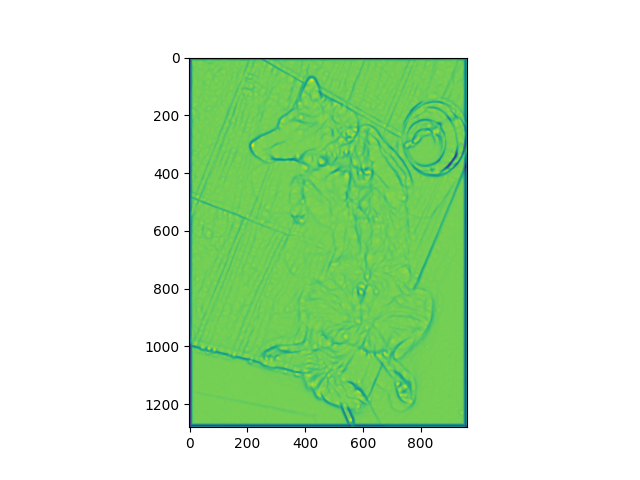

# apply-pseudo-ridge-filter
Apply a pseudo ridge filter 

Usage is 

`python3 script.py input-image` displays in screen

`python3 script.py input-image output-image` saves as output-image

`python3 script.py input-image output-image N` uses "N" as the sigma parameter for the smoothing, default 1

`python3 script.py` input-image output-image N y` shows the minimum-field (as opposed to the default: the max eigenvalue field)

---

Example with the dog of a friend:

